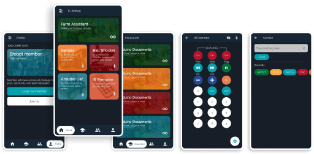

# Erobot-App

Start date: 24 July, 2020

Welcome to Open Source Project. 
Erobot is designed to control Arduino robot via Bluetooth. The app is developing using Flutter.
 
  
Functions of the app are: 

* Farm Assistant : (in planning)
* Arduino Documents : Document of how to build robots
* Login, Sign up on the app
* Sender : Send string or character to Arduino via bluetooth
* Ball Shooter : A controller to control ball shooter robot, servo, and speed
* Arduino Car : A controller to controll Arduino car and spead
* IR Remote : Vitual IR Remote via Bluetooth.

 
 
Prototype and design here: https://www.figma.com/file/x1edWP3L1by9QWuI5EVUiP/E-Robot-App?node-id=0%3A1
 
 
Build release to test: 
@Method1: 
:~/erobot_app$ flutter build apk --release 
:~/erobot_app$ build/app/outputs/flutter-apk/app-release.apk
  
@Method2: this produce 3 apk, choose 1 for your device 
:~/erobot_app$ flutter build apk --target-platform android-arm, android-arm64, android-x64 --split-per-abi
 
:~/erobot_app$ flutter install build/app/outputs/apk/release/app-arm64-v8a-release.apk
  
@Method3: 
:~/erobot_app$ flutter build appbundle --target-platform android-arm, android-arm64, android-x64
 
:~/erobot_app$ flutter install build/app/outputs/bundle/release/app-release.aab

 
 
 
