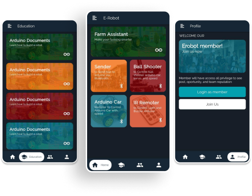

# Erobot-App
Start date: 24 July, 2020

Welcome to Open Source Project. 
Erobot is designed to control Arduino robot via Bluetooth. The app is developing using Flutter.

Functions of the app are:
- Farm Assistant : (in planning)
- Arduino Documents : Document of how to build robots
- Login, Sign up on the app
- Sender : Send string or character to Arduino via bluetooth
- Ball Shooter : A controller to control ball shooter robot, servo, and speed
- Arduino Car : A controller to controll Arduino car and spead
- IR Remote : Vitual IR Remote via Bluetooth.

Prototype and design here: https://www.figma.com/file/x1edWP3L1by9QWuI5EVUiP/E-Robot-App?node-id=0%3A1

Build release to test: 
erobot@dev:~/erobot_app$ flutter build apk --target-platform android-arm64 --split-per-abi && flutter install build/app/outputs/apk/release/app-arm64-v8a-release.apk

 
 
 
